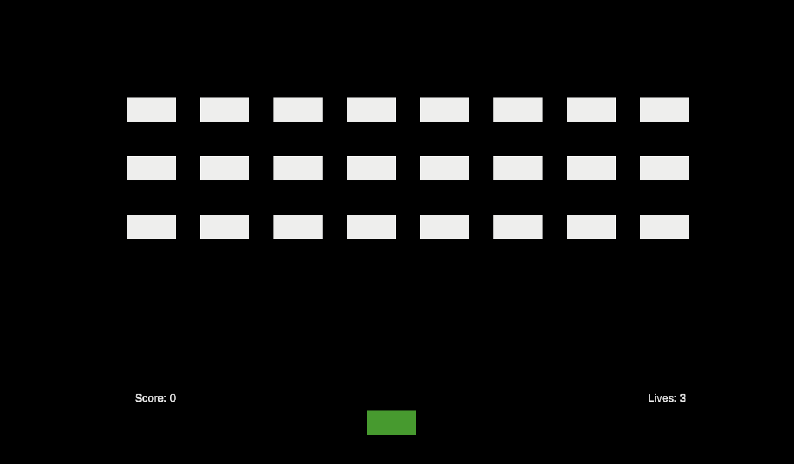
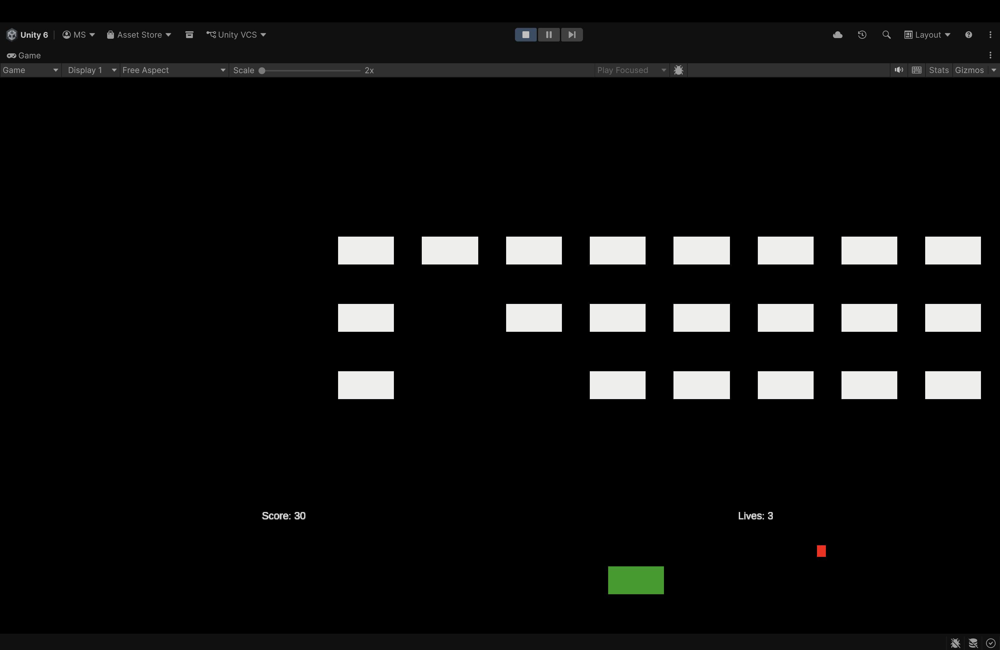
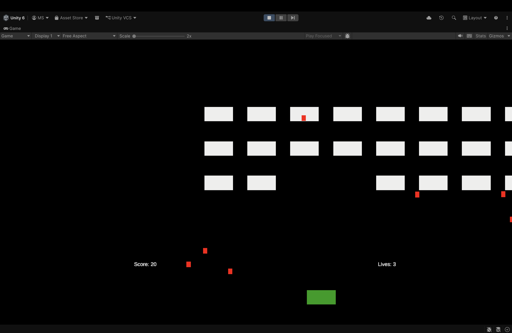

# Space Invaders Game

## Engine Used
Unity

## Project Overview
This project is a Space Invaders–style arcade shooter game created in Unity. The player controls a spaceship that can move left and right and shoot bullets to destroy enemy invaders. Enemies move horizontally across the screen and gradually descend toward the player. The game includes score tracking, enemy shooting mechanics, collision detection, and a game over system.

## Features
- Player-controlled spaceship movement
- Upward shooting mechanic
- Multiple enemy invaders arranged in rows
- Enemy movement with horizontal motion and downward shifts
- Enemy bullets
- Collision detection
- Score system
- Score display UI
- Lives and game over system

## What I Learned
- Creating player movement and shooting mechanics in Unity
- Working with prefabs and object instantiation
- Handling collisions using Unity's physics system
- Managing UI elements such as score and lives displays
- Implementing enemy movement patterns and game state management
- Using scripts to control gameplay logic

## Challenges Faced
- Creating enemy movement that closely resembles classic Space Invaders
- Managing enemy shooting frequency for balanced gameplay
- Handling collisions between bullets, enemies, and the player
- Organizing game objects and scripts efficiently
- Ensuring score and lives update correctly during gameplay

## How to Play
- Use the Left Arrow and Right Arrow keys to move the spaceship.
- Press Spacebar to shoot.
- Destroy enemies to earn points.
- Avoid enemy bullets and survive as long as possible.

## Screenshots

### Gameplay

